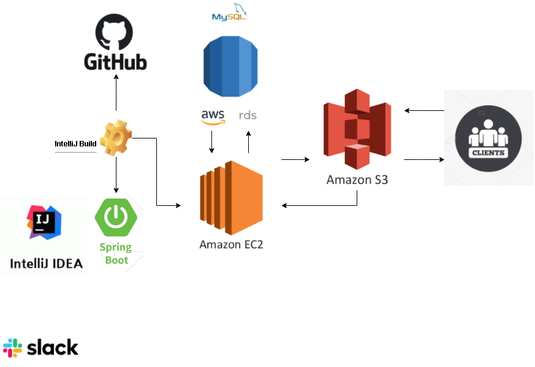
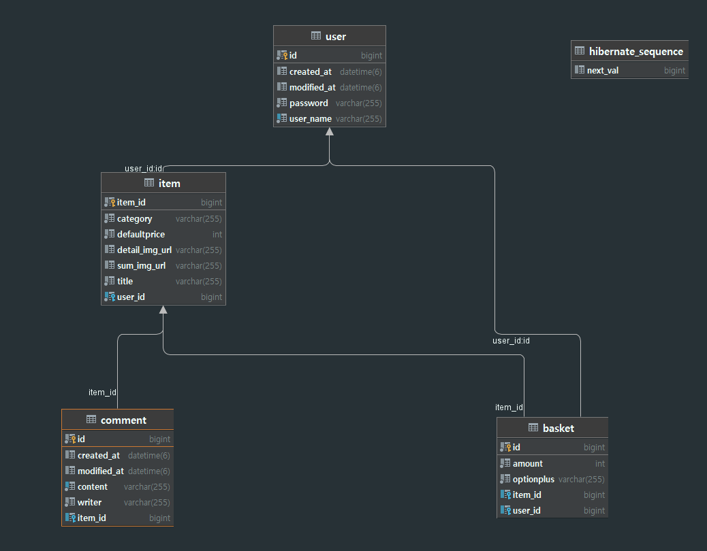

# MeetShop clone coding

## 프로젝트 소개

> **정육각 클론코딩**

- 정육각 사이트 클론코딩으로 똑같은 기능구현과 뷰를 목표로 코딩 
- 노션 주소: https://guiltless-dimple-401.notion.site/12-015dc8904c144284924708e93c7424a6

#### &#128198;**프로젝트 기간**

2021년 10월 18일 ~ 2021년 10월 22일

#### 👥개발인원

- **최원빈**(Spring)
- **이승준**(Spring)
- **이재성**(Spring)

## 프로젝트 구조

## 사용 기술 및 환경

#### 🛠기술스텍

- Spring
  - Java 8 
  - SpringBoot 2.5.2
  - Gradle 7.0.2
  - JPA
  - MySQL 8.0
  - H2 Database (for test)
- AWS EC2 (ubuntu 18.04 LTS)
- AWS RDS (MySQL 8.0)

## 프로젝트의 주요 관심사 

#### 📋공통사항

- 객체 지향적인 프로그래밍
- 지속적인 성능 개선을 위해 노력
- 리팩토링

## 브랜치 관리 및 커뮤니케이션 전략

#### Git 관리

- main, 개인 branch를 사용하여 main에서는 release 버전만 사용함

#### Slack

- Back과 Front가 원활히 소통, 정보를 공유하기위해 상시 소통
- 에러를 공유하며 Back, Front 구분없이 같이 해결하여 에러잡는 시간을 단축
- 실시간 진행사항을 공유하여 서로 다른 개발방향을 가지지 않도록 함 

## DB ERD

